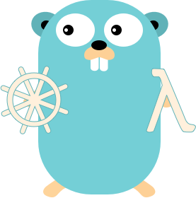
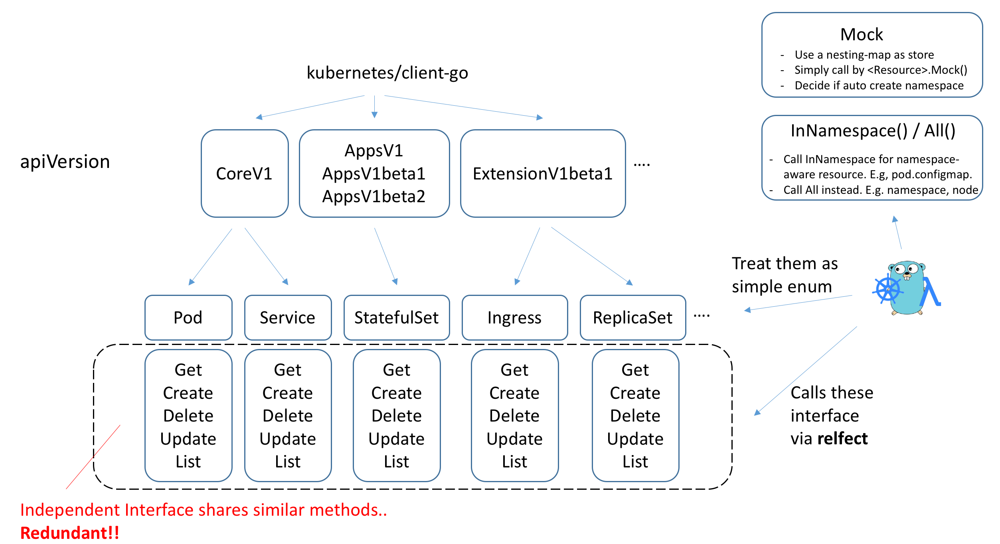

# Kubernetes Client Lambda #

[](https://travis-ci.org/yue9944882/kubernetes-client-lambda)
[](https://codecov.io/gh/yue9944882/kubernetes-client-lambda)
[](https://godoc.org/github.com/yue9944882/kubernetes-client-lambda)


- [What is Kubernetes Client Lambda?](#whats-kcl)
    - [InCluster & OutOfCluster example](#cluster-example)
    - [Watch example](#watch-example)
    - [Mock example](#mock-example)
- [How to get it?](#how-to-get-it)
- [Why Kubernetes Client Lambda is better?](#why-better)
- [Supported Lambda Function Type](#lambda-type)
- [Primitive Pipeline Type](#pipeline-type)

<a name="whats-kcl"></a> 
### What is Kubernetes Client Lambda? ###




Kubernetes Client Lambda (KCL) is a wrapper library over [kubernetes/client-go](https://github.com/kubernetes/client-go) which provides light-weight lambda-styled streamized kubernetes resource manipulation interface. This project is basically inspired by Groovy style lambda, and is aiming at reducing the coding-overhead when referencing too many struct / interface provided by  [kubernetes/client-go](https://github.com/kubernetes/client-go). The only dependency of this project is [kubernetes/client-go](https://github.com/kubernetes/client-go), so this project can be pure and light-weight for you. Currently KCL only provides support for those common-used resources like Pod / Service.. [Click](https://github.com/yue9944882/kubernetes-client-lambda/blob/cfaa5564df0a4212ef9230be9ddd05a5c7034916/resource.go#L9) to see all the supported resources in KCL. 

Note that: **KCL can be compatible with any kubernetes version, because KCL is a wrapping over client-go and client-go will provide it**

Also, KCL defines more useful primitive operation type beyond those provided, e.g. Create-If-Not-Exist, Update-Or-Create, Delete-If-Exist.., which can help you make your code more clean. These primitive operation is always at the end of streaming and consumes all the remaining element and apply operation on every element. 

Basically, KCL is implemented by golang `reflect` and golang native facilities. KCL defines various resources provided by kubernetes as enumeratoin which hides some unneccessary details like API-version. Sometimes, managing these details can be painful for kubernetes developers. Meanwhile, I find it costs time when mocking kubernetes resources in static unit test, so KCL provides a very simple mocking for kubernetes resources which is implemented via `map`. 



<a name="cluster-example"></a>
With KCL, you can operate kubernetes resources like this example:

```go
// See doc for more info about lambda functions Grep / Map..
import kubernetes "github.com/yue9944882/kubernetes-client-lambda"

// In-Cluster example
kubernetes.InCluster().Type(kubernetes.ReplicaSet).InNamespace("test").NamePrefix("foo-").Map(func(rs *api_ext_v1.ReplicaSet) rs*api_ext_v1.ReplicaSet {
    // Edit in-place or clone a new one
    rs.Meta.Labels["foo-label1"] = "test" 
    return rs
}).Update()


// Out-Of-Cluster example
kubernetes.OutOfCluster(config).Type(kubernetes.Pod).InNamespace("devops").NameEqual("test-pod").Each(
    func(pod *api_v1.Pod) {
        count++
    },
)
```

<a name="watch-example"></a>
As the following example is shown, Calling `Mock()` on Kubernetes Type Enumeration will create the expected mocking resources for you:

```go
import kubernetes "github.com/yue9944882/kubernetes-client-lambda"

kubernetes.Mock().Type(kubernetes.ReplicaSet).InNamespace("test").Add(
    // An anonymous function simply returns a pointer to kubernetes resource 
    // Returned objects will be added to stream
    func(){
        rs.Name = "foo"
        rs.Namespace = "test"
        return &rs
    },
).Create()
```

<a name="mock-example"></a>
Also watching the changes can be easier via KCL's wrapping of client-go's informer. You don't have to directly access events from client-go, instead, registering / unregistering closure to KCL's API:
```go
import kubernetes "github.com/yue9944882/kubernetes-client-lambda"
import "k8s.io/apimachinery/pkg/watch"

var kcl KubernetesClientLambda = kubernetes.InCluster()
// kcl = kubernetes.Mock()

kcl.Type(kubernetes.ReplicaSet).WatchNamespace("default").Register(watch.Added, func(rs *api_v1.ReplicaSet){
    fmt.Println(rs.Name)
})
```

<a name="how-to-get-it"></a>
### How to Get it? ###

```
go get github.com/yue9944882/kubernetes-client-lambda
```

<a name="why-better"></a>
### Why Kubernetes Client Lambda is better? ###

- Manipulating kubernetes resources in one line
- Lambda-styled kubernetes resource processing.
- Watch resource event by registering a ["Function"](#lambda-type) lambda
- Pipelined and streamlized.
- Light-weight and only depends on [kubernetes/client-go](https://github.com/kubernetes/client-go)
- User-friendly mocking kubernetes static interface

Checkout more examples under `example` folder.


### Supported Lambda Function Type ###

First we have following types of lambda function: 

(KR denotes Kubernetes Resources, a pointer to resouce, e.g. *api_v1.Pod, *api_ext_v1.ReplicaSet..)

##### Primitive Lambda Type #####

<a name="lambda-type"></a>

| Name | Parameter Type | Return Type |
|---|---|---|
| Function | KR | - |
| Consumer | KR | KR |
| Predicate | KR | bool |
| Producer | - | KR |

##### Kubernetes Resource Lambda Snippet #####

| Name | Pipelinable | Description |
|---|---|----|
| NameEqual | yes | Filter out resources if its name mismatches |
| NamePrefix | yes | Filter out resources if its name doesn't have the prefix |
| NameRegex | yes | Filter out resources if its name doesn't match the regular expression |
| HasAnnotation | yes | Filter out resources if it doesn't have the annotation |
| HasAnnotationKey | yes | Filter out resources if it doesn't have the annotation key |
| HasLabel | yes | Filter out resources if it doesn't have the label |
| HasLabelKey | yes | Filter out resources if it doesn't have the label key |


And these lambda can be consumed by following function: 


<a name="pipeline-type"></a>
##### Primitive Pipeline Type #####

| Name | Pipelinable | Lambda Type | Description |
|---|---|----|---|
| Collect | yes | - | Deep copies the elements and put them into collection | 
| Add | yes | Producer | Add the element returned by lambda into collection |
| Map | yes | Consumer | Add all the elements returned by lambda to a new collection |
| Grep | yes | Predicate | Remove the element from collection if applied lambda returned a `false` |
| First | yes | Predicate | Take only the first element when applied lambda returned a `true` |
| Iter | no | Function | Apply the lambda to every elements in the collection |


Primitive methods like `CreateIfNotExist`, `DeleteIfExist` have no parameter and just consumes all elements at the end of the pipelining. 
Here are supported primitive kubernetes operation functions below:

##### Basic Operation #####

| Operation | Param | Return1 | Return2 | 
|---|---|---|---|
| Each | Function | lambda error | - |
| Any | Predicate | bool | lambda error |
| Every | Predicate | bool | lambda error |
| NotEmpty | - | bool | lambda error |

##### Kubernetes Operation #####

| Operation | Param | Return1 | Return2 | 
|---|---|---|---|
| Create | - | bool(sucess) | lambda error |
| CreateIfNotExists | - | bool(success) | lambda error |
| Delete | - | bool(sucess) | lambda error |
| DeleteIfExists | - |  bool(success) | lambda error |
| Update | - |  bool(sucess) | lambda error |
| UpdateIfExists | - |  bool(success) | lambda error |
| UpdateOrCreate | - | bool(success) | lambda error |


